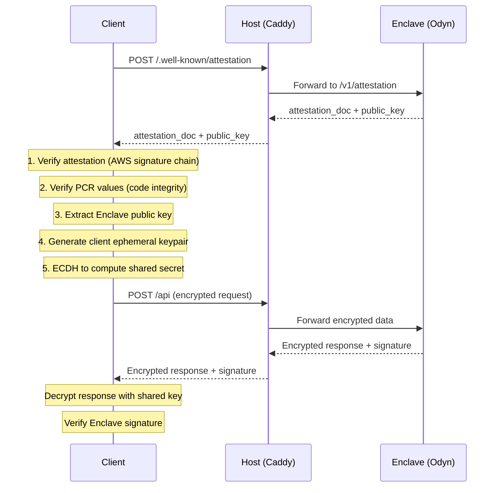

# Nova Platform Data Encryption Guide

This document describes the communication architecture between users and Enclave applications in the Nova Platform, security risks, and the recommended end-to-end encryption approach.

## 1. Communication Architecture Overview

### 1.1 Complete Communication Flow

```
User (Browser/Client)
        │
        │ HTTPS (TLS 1.3)
        ▼
┌─────────────────────────────────────────────────────────────┐
│                    EC2 Instance (Host)                       │
│  ┌─────────────────────────────────────────────────────────┐│
│  │              Caddy Reverse Proxy                         ││
│  │  - Automatic HTTPS (Let's Encrypt)                       ││
│  │  - Routes /.well-known/attestation → attestation port    ││
│  │  - Routes other requests → app port                      ││
│  └─────────────────────────────────────────────────────────┘│
│                           │                                  │
│                      VSOCK (Plaintext)                       │
│                           │                                  │
│  ┌─────────────────────────────────────────────────────────┐│
│  │              Nitro Enclave (Trusted Zone)                ││
│  │  - Isolated memory & CPU                                 ││
│  │  - No local persistent storage; optional S3 via Internal API ││
│  │  - Communicates with Host only via VSOCK                 ││
│  │  - Odyn Supervisor + Your Application                    ││
│  └─────────────────────────────────────────────────────────┘│
└─────────────────────────────────────────────────────────────┘
```

### 1.2 Caddy Reverse Proxy Configuration

In the Nova Platform's app-node, each deployed application automatically gets a Caddy reverse proxy configuration:

```caddy
# App {app_id} - Auto-generated by app-node agent
{domains} {
    # Route attestation requests to attestation port
    handle /.well-known/attestation* {
        rewrite * /v1/attestation
        reverse_proxy localhost:{attestation_port}
    }
    
    # Route other requests to app port
    handle {
        reverse_proxy localhost:{app_port}
    }
    
    # Automatic HTTPS with Let's Encrypt
}
```

**Caddy's Responsibilities:**
- **TLS Termination**: Automatically obtains and renews Let's Encrypt certificates
- **Request Routing**: Distributes attestation and application requests to correct ports
- **Reverse Proxy**: Converts external HTTPS requests to internal HTTP requests

## 2. Security Risk Analysis

### 2.1 Nitro Enclave Threat Model

AWS Nitro Enclaves assume that **the Host is untrusted**. Even if an attacker fully controls the Host OS, they cannot:
- Read Enclave memory
- Interfere with computations inside the Enclave

However, if an attacker controls the Host, they can:

| Attack Vector | Risk Description |
|---------------|------------------|
| **Eavesdrop on VSOCK** | Plaintext VSOCK communication can be intercepted by malware on the Host |
| **Tamper with Requests/Responses** | Attacker can modify data entering or leaving the Enclave |
| **Man-in-the-Middle Attack** | Attacker can impersonate the Enclave when communicating with users |

### 2.2 Current Architecture Security Boundaries

```
User ──────HTTPS────── Caddy ──────Plaintext────── Enclave
      ↑                      ↑
      │                      │
   TLS Protected          NOT Protected!
   (to Host only)       (Host ↔ Enclave)
```

**Critical Issue: Caddy TLS only protects traffic to the Host, not to the Enclave!**

- Caddy runs on the Host, TLS terminates at Caddy
- The VSOCK channel between Host and Enclave is plaintext
- If the Host is compromised, attackers can fully eavesdrop and tamper with communication

### 2.3 Why End-to-End Encryption is Needed

Standard HTTPS/TLS cannot solve these problems:

1. **Cannot verify Enclave identity**: Users cannot confirm their requests are processed by a trusted Enclave
2. **Host can eavesdrop**: TLS terminates at Host, plaintext is exposed in Host memory
3. **Cannot prevent Host tampering**: A malicious Host can modify requests or responses

## 3. Recommended End-to-End Encryption Approach

### 3.1 Approach Overview

Use **Attestation + P-384 ECDH + AES-256-GCM** to achieve true end-to-end encryption:



### 3.2 Encryption Specifications

| Component | Specification |
|-----------|---------------|
| **Key Agreement** | P-384 ECDH (secp384r1) |
| **Key Derivation** | HKDF-SHA256, info="encryption data" |
| **Symmetric Encryption** | AES-256-GCM |
| **Nonce** | 32 random bytes (first 12 bytes used as IV) |
| **Response Signature** | EIP-191 signature (Enclave ETH key) |

### 3.3 Detailed Encryption Flow

#### Step 1: Obtain Attestation and Public Key

```typescript
// Client requests attestation
const response = await fetch(`${enclaveUrl}/.well-known/attestation`, {
    method: 'POST',
    body: JSON.stringify({ nonce: '', public_key: '' })
});

const { attestation_doc, public_key } = await response.json();

// attestation_doc: Base64-encoded CBOR document with AWS signature
// public_key: Enclave's P-384 public key (DER format, hex-encoded)
```

#### Step 2: Verify Attestation

```typescript
// 1. Parse CBOR attestation document
// 2. Verify AWS signature chain (root → intermediate → attestation)
// 3. Verify PCR values match expected (code integrity)
// 4. Confirm public_key is included in attestation
```

#### Step 3: Generate Client Keypair and Derive Shared Secret

```typescript
// Generate client ephemeral keypair
const keyPair = await crypto.subtle.generateKey(
    { name: 'ECDH', namedCurve: 'P-384' },
    true,
    ['deriveBits']
);

// Import server public key
const serverPubKey = await crypto.subtle.importKey(
    'raw', serverPubKeyBytes,
    { name: 'ECDH', namedCurve: 'P-384' },
    true, []
);

// ECDH to compute shared secret
const sharedBits = await crypto.subtle.deriveBits(
    { name: 'ECDH', public: serverPubKey },
    keyPair.privateKey,
    384
);

// HKDF to derive AES key
const hkdfKey = await crypto.subtle.importKey('raw', sharedBits, 'HKDF', false, ['deriveKey']);
const aesKey = await crypto.subtle.deriveKey(
    { name: 'HKDF', hash: 'SHA-256', salt: new Uint8Array(0), info: new TextEncoder().encode('encryption data') },
    hkdfKey,
    { name: 'AES-GCM', length: 256 },
    false,
    ['encrypt', 'decrypt']
);
```

#### Step 4: Encrypt Request

```typescript
const nonce = crypto.getRandomValues(new Uint8Array(32));
const plaintext = JSON.stringify({ message: 'Hello, Enclave!' });

const ciphertext = await crypto.subtle.encrypt(
    { name: 'AES-GCM', iv: nonce.slice(0, 12) },
    aesKey,
    new TextEncoder().encode(plaintext)
);

// Send encrypted request
await fetch(`${enclaveUrl}/api`, {
    method: 'POST',
    headers: { 'Content-Type': 'application/json' },
    body: JSON.stringify({
        nonce: bufferToHex(nonce),
        public_key: bufferToHex(clientPubKeyDer),
        data: bufferToHex(ciphertext)
    })
});
```

#### Step 5: Enclave Decrypts and Responds

```python
# Enclave uses Odyn API to decrypt
from odyn import Odyn

odyn = Odyn()

# Decrypt client request
plaintext = odyn.decrypt_data(
    nonce_hex=request.nonce,
    client_public_key_hex=request.public_key,
    encrypted_data_hex=request.data
)

# Process request...
response_data = process_request(plaintext)

# Encrypt response
encrypted_response, enclave_pub_key, response_nonce = odyn.encrypt_data(
    data=json.dumps(response_data),
    client_public_key_der=bytes.fromhex(request.public_key)
)

# Sign response (EIP-191)
signature = odyn.sign_message(response_data)
```

## 4. Alternative Encryption Approaches

### 4.1 Approach Comparison

| Approach | Security Level | Browser Support | Implementation Complexity | Use Case |
|----------|---------------|-----------------|--------------------------|----------|
| **Caddy TLS only** | Low | Native | Low | Scenarios where Host is trusted |
| **VSOCK TLS** | Medium | Native | Medium | Protect internal channel |
| **E2E Encryption (Recommended)** | High | Requires JS | High | Untrusted Host |
| **KMS + Attestation** | High | Native | Very High | Enterprise production |

### 4.2 Choosing Based on Threat Model

| Threat Assumption | Recommended Approach |
|-------------------|---------------------|
| Trust Host, only defend against external attacks | Caddy TLS is sufficient |
| Don't trust Host, need data confidentiality | **E2E Encryption (recommended in this doc)** |
| Need fixed domain + enterprise security | KMS + Attestation |

## 5. Reference Implementation

### 5.1 Complete Example Project

**secured-chat-bot**: An end-to-end encrypted AI chat application

- Repository: [sparsity-nova-examples/secured-chat-bot](https://github.com/sparsity-xyz/sparsity-nova-examples/tree/main/secured-chat-bot)

Project structure:
```
secured-chat-bot/
├── enclave/           # TEE backend
│   ├── app.py         # Flask API + encryption handling
│   └── odyn.py        # Odyn API wrapper (with encryption methods)
└── frontend/          # Next.js frontend
    └── src/lib/
        ├── crypto.ts      # ECDH + AES-GCM encryption
        └── attestation.ts # Attestation verification
```

### 5.2 Odyn Python Wrapper (Backend)

`odyn.py` provides a simple encryption API:

```python
from odyn import Odyn

odyn = Odyn()

# Get Enclave public key
pub_data = odyn.get_encryption_public_key_data()
# Returns: {'public_key_der': '0x...', 'public_key_pem': '-----BEGIN PUBLIC KEY-----...'}

# Decrypt client data
plaintext = odyn.decrypt_data(
    nonce_hex="...",
    client_public_key_hex="0x...",
    encrypted_data_hex="0x..."
)

# Encrypt response data
encrypted_data, enclave_pub_key, nonce = odyn.encrypt_data(
    data="response string",
    client_public_key_der=client_pub_key_bytes
)

# Sign data (EIP-191)
signature = odyn.sign_message({"key": "value"})
```

### 5.3 Frontend Encryption Client (TypeScript)

The `EnclaveClient` class in `crypto.ts` wraps the complete flow:

```typescript
import { EnclaveClient } from './crypto';

const client = new EnclaveClient();

// Connect to Enclave (get attestation + establish keys)
const attestation = await client.connect('https://your-app.example.com');

// Encrypt request
const encrypted = await client.encrypt(JSON.stringify({ message: 'Hello' }));

// Send encrypted request
const response = await fetch('/api', {
    method: 'POST',
    body: JSON.stringify(encrypted)
});

// Decrypt response
const decrypted = await client.decrypt(await response.json());
```

### 5.4 Odyn Internal API Reference

The Odyn Supervisor runs at `localhost:18000` inside the Enclave and provides the following encryption-related APIs. Your application can call these APIs via HTTP to implement end-to-end encryption.

#### 5.4.1 Get Encryption Public Key

Retrieve the Enclave's P-384 public key for ECDH key agreement.

- **URL:** `/v1/encryption/public_key`
- **Method:** `GET`
- **Response:**
  ```json
  {
    "public_key_der": "0x3076...",
    "public_key_pem": "-----BEGIN PUBLIC KEY-----\n...\n-----END PUBLIC KEY-----"
  }
  ```

| Field | Description |
|-------|-------------|
| `public_key_der` | Hex-encoded DER format public key (SPKI), suitable for encryption operations |
| `public_key_pem` | PEM format public key, suitable for standard crypto libraries |

#### 5.4.2 Decrypt Client Data

Decrypt data sent from a client using ECDH + AES-256-GCM.

- **URL:** `/v1/encryption/decrypt`
- **Method:** `POST`
- **Content-Type:** `application/json`
- **Request Body:**
  ```json
  {
    "nonce": "0x...",              // Hex-encoded nonce (at least 12 bytes)
    "client_public_key": "0x...",  // Hex-encoded client DER public key
    "encrypted_data": "0x..."      // Hex-encoded ciphertext (with auth tag)
  }
  ```
- **Response:**
  ```json
  {
    "plaintext": "decrypted string"
  }
  ```

**How it works:**
1. Odyn uses the Enclave private key and client public key to perform ECDH and compute shared secret
2. Uses HKDF-SHA256 to derive AES-256 key
3. Uses AES-GCM to decrypt data

#### 5.4.3 Encrypt Response Data

Encrypt data to send to a client.

- **URL:** `/v1/encryption/encrypt`
- **Method:** `POST`
- **Content-Type:** `application/json`
- **Request Body:**
  ```json
  {
    "plaintext": "string to encrypt",
    "client_public_key": "0x..."   // Hex-encoded client DER public key
  }
  ```
- **Response:**
  ```json
  {
    "encrypted_data": "...",       // Hex-encoded ciphertext
    "enclave_public_key": "...",   // Hex-encoded Enclave public key
    "nonce": "..."                 // Hex-encoded nonce
  }
  ```

#### 5.4.4 Generate Attestation Document

Generate an attestation document from the Nitro Secure Module (NSM).

- **URL:** `/v1/attestation`
- **Method:** `POST`
- **Content-Type:** `application/json`
- **Request Body:**
  ```json
  {
    "nonce": "base64_encoded_nonce",        // Optional
    "public_key": "PEM_encoded_public_key", // Optional, usually the encryption public key
    "user_data": "base64_encoded_user_data" // Optional
  }
  ```
- **Response:** 
  - **Content-Type:** `application/cbor`
  - **Body:** Binary CBOR data (Attestation Document)

**Attestation Document contains:**
- PCR values (code integrity hashes)
- Your provided public_key (if any)
- AWS Nitro signature chain

#### 5.4.5 Sign Message (EIP-191)

Sign a message using the Enclave's Ethereum private key.

- **URL:** `/v1/eth/sign`
- **Method:** `POST`
- **Content-Type:** `application/json`
- **Request Body:**
  ```json
  {
    "message": "hello world",       // Plaintext to sign (non-empty)
    "include_attestation": false    // Whether to include attestation
  }
  ```
- **Response:**
  ```json
  {
    "signature": "0x...",
    "address": "0x...",
    "attestation": null
  }
  ```

**Signature format:** EIP-191 personal_sign, automatically adds `"\u0019Ethereum Signed Message:\n<len>"` prefix.

#### 5.4.6 Get Ethereum Address

Retrieve the Enclave's Ethereum address and public key.

- **URL:** `/v1/eth/address`
- **Method:** `GET`
- **Response:**
  ```json
  {
    "address": "0x742d35Cc6634C0532925a3b844Bc9e7595f0bEb",
    "public_key": "0x04..."
  }
  ```

#### 5.4.7 Get Random Bytes

Obtain cryptographically secure random bytes from the Nitro Secure Module.

- **URL:** `/v1/random`
- **Method:** `GET`
- **Response:**
  ```json
  {
    "random_bytes": "0x..."  // 32 bytes hex-encoded
  }
  ```

#### 5.4.8 API Usage Example (Python)

Complete encryption handling flow:

```python
import requests
import json

ODYN_API = "http://localhost:18000"

class EnclaveEncryption:
    def decrypt_request(self, encrypted_payload):
        """Decrypt a request from the client"""
        response = requests.post(
            f"{ODYN_API}/v1/encryption/decrypt",
            json={
                "nonce": encrypted_payload["nonce"],
                "client_public_key": encrypted_payload["public_key"],
                "encrypted_data": encrypted_payload["data"]
            }
        )
        response.raise_for_status()
        return response.json()["plaintext"]
    
    def encrypt_response(self, plaintext, client_public_key):
        """Encrypt a response to send to the client"""
        response = requests.post(
            f"{ODYN_API}/v1/encryption/encrypt",
            json={
                "plaintext": plaintext,
                "client_public_key": client_public_key
            }
        )
        response.raise_for_status()
        return response.json()
    
    def sign_response(self, data):
        """Sign response data"""
        message = json.dumps(data, sort_keys=True, separators=(',', ':'))
        response = requests.post(
            f"{ODYN_API}/v1/eth/sign",
            json={"message": message, "include_attestation": False}
        )
        response.raise_for_status()
        return response.json()["signature"]

# Usage in a Flask application
encryption = EnclaveEncryption()

@app.route('/api/secure', methods=['POST'])
def secure_endpoint():
    encrypted_request = request.json
    
    # 1. Decrypt request
    plaintext = encryption.decrypt_request(encrypted_request)
    data = json.loads(plaintext)
    
    # 2. Process business logic
    result = process_data(data)
    
    # 3. Encrypt response
    encrypted_response = encryption.encrypt_response(
        json.dumps(result),
        encrypted_request["public_key"]
    )
    
    # 4. Sign response
    signature = encryption.sign_response(result)
    encrypted_response["signature"] = signature
    
    return jsonify(encrypted_response)
```

## 6. Summary and Best Practices

### 6.1 Key Points

1. **Caddy TLS is not end-to-end encryption** - TLS terminates at Host, VSOCK channel is plaintext
2. **Use Attestation to verify Enclave identity** - Ensures communication is with a trusted Enclave
3. **Use ECDH + AES-GCM to encrypt data** - Even if Host is compromised, data remains confidential
4. **Verify response signatures** - Ensures responses come from the same Enclave

### 6.2 Best Practices Checklist

- [ ] Implement attestation verification logic in the client
- [ ] Use P-384 or secp256k1 for ECDH key agreement
- [ ] Generate a new nonce for each request
- [ ] Verify Enclave response signatures
- [ ] Verify PCR values in production environments

### 6.3 Related Documentation

- [Odyn Internal API](https://github.com/sparsity-xyz/enclaver/blob/sparsity/docs/internal_api.md) - Full Odyn API reference
- [Enclaver Architecture](https://github.com/sparsity-xyz/enclaver/blob/sparsity/docs/architecture.md) - Architecture overview
- [Nova Examples](https://github.com/sparsity-xyz/sparsity-nova-examples/) - More example projects
