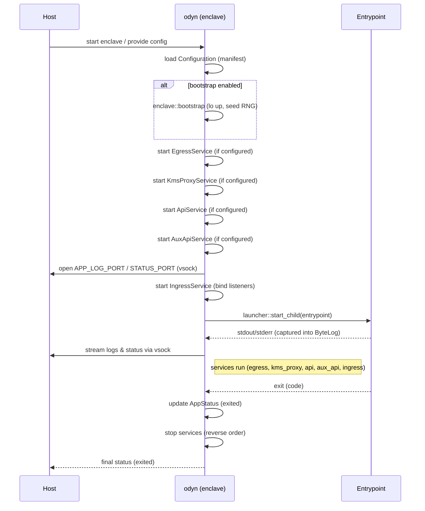

# Odyn — Enclave Supervisor (detailed reference)

This document provides a full, English-language reference for `odyn`, the enclave supervisor binary implemented under `enclaver/src/bin/odyn/`.
It covers overall responsibilities and architecture, a detailed per-module breakdown (functions, data structures, external dependencies, lifecycle and error modes), an example manifest, host-side access examples (VSOCK), common pitfalls, extension points, and a mermaid time-sequence diagram showing startup, runtime, and shutdown interactions.

---

## 1. Short summary

Odyn is the supervisor that runs inside an enclave and manages the enclave application (the "entrypoint"). Its main responsibilities are:

- Prepare enclave platform primitives (bring up loopback, seed RNG from NSM).
- Provide local infrastructure services that the entrypoint expects (ingress listeners, optional egress proxy, optional KMS proxy, internal API server).
- Capture and expose application logs and runtime status over VSOCK to the host.
- Launch and supervise the entrypoint process, ensure proper reaping of children to avoid zombies, and translate exit status into an observable final state.

Design goals: reproducible startup order, clear dependencies between services (egress needed before kms_proxy), small surface area for host control via vsock/API, and a policy-driven egress allow list for safe outbound connectivity.

---

## 2. Quick example manifest

A minimal manifest to show common sections used by `odyn`:

```yaml
ingress:
  - listen_port: 8080

egress:
  allow:
    - "169.254.169.254"            # IMDS (if kms_proxy is used)
    - "kms.us-east-1.amazonaws.com"
  proxy_port: 3128

kms_proxy:
  listen_port: 9000

api:
  listen_port: 8000

aux_api:
  listen_port: 8001  # Optional: defaults to api_port + 1 if not specified

sources:
  odyn: "public.ecr.aws/d4t4u8d2/sparsity-ai/odyn:latest"
  sleeve: "public.ecr.aws/d4t4u8d2/sparsity-ai/sleeve:latest"
```

Notes:
- If you enable `kms_proxy`, ensure the egress allow list includes IMDS (`169.254.169.254`) and the KMS endpoints required by the region(s).
- TLS ingress entries are supported; PEM files are read from `config_dir/tls/server/<port>/{cert.pem,key.pem}`.

---

## 3. Host-side: accessing logs & status (VSOCK)

`odyn` exposes two common VSOCK endpoints (constants defined in the project):

- `APP_LOG_PORT` — a stream of the entrypoint's stdout/stderr (ring-buffered).
- `STATUS_PORT` — a JSON status stream reporting lifecycle events (running, exited, fatal) and metadata.

Examples (host):

- vsockcat (if available):

```bash
# stream app logs
vsockcat <enclave-cid> $APP_LOG_PORT

# stream status JSON
vsockcat <enclave-cid> $STATUS_PORT
```

- socat (if built with vsock support):

```bash
socat - VSOCK:cid=3,port=${STATUS_PORT}
```

- Python AF_VSOCK (minimal client):

```python
import socket
sock = socket.socket(socket.AF_VSOCK, socket.SOCK_STREAM)
sock.connect((2, PORT))  # host CID often 2
try:
    while True:
        data = sock.recv(4096)
        if not data:
            break
        print(data.decode(), end='')
finally:
    sock.close()
```

---

## 4. Component details (per module)

The `enclaver/src/bin/odyn` binary is organized into the following modules. Each entry below describes main responsibilities, primary data structures, external dependencies, key behaviors and lifecycle, common errors/boundary conditions, and suggested extension points.

### 4.1 `main.rs`

- Responsibilities
  - Entry point: parse CLI args, load configuration, initialize logging/tracing, and orchestrate service startup/shutdown.
  - Establish deterministic startup order so dependent services (e.g., kms_proxy) have required preconditions (egress) available.
  - Provide final exit plumbing that updates `AppStatus` and returns an appropriate process exit code.

- Key data structures
  - `CliArgs` (clap) — flags: `--config-dir`, `--no-bootstrap`, `--no-console`, `--entrypoint`, `--verbose`, etc.
  - Runtime handles/registrations for started services (EgressService, KmsProxyService, ApiService, IngressService, Console/AppLog, Entrypoint handle).

- External deps
  - `tokio` runtime, `clap` for CLI, `tracing`/`log` for logging, `anyhow`/`thiserror` for errors, and the other internal modules.

- Lifecycle / behaviors
  - Load manifest via `Configuration::load(config_dir)`.
  - Optionally run `enclave::bootstrap()` unless `--no-bootstrap`.
  - Start services in order: Egress (if enabled) → KMS proxy (if configured) → API → Console/AppLog/Status → Ingress → Launch the entrypoint. Monitor the sentinel and on exit stop services in reverse order.

- Common errors
  - Failures in manifest loading, missing TLS files, or inability to reach NSM are treated as fatal startup errors.

- Extensions
  - Add health endpoints, metrics initialization (Prometheus), or pluggable lifecycle hooks.

---

### 4.2 `config.rs`

- Responsibilities
  - Read the manifest from `--config-dir`, validate semantics, and build a `Configuration` object for runtime use.
  - Construct `ListenerConfig`s for ingress entries and load server TLS certs when requested.

- Key data structures
  - `Configuration { config_dir: PathBuf, manifest: Manifest, listener_configs: HashMap<u16, ListenerConfig> }`.
  - `ListenerConfig` — variants for TCP and TLS (e.g., `Tcp(SocketAddr)` or `Tls(Arc<rustls::ServerConfig>)`).

- External deps
  - rustls, http types, std::fs for reading PEMs, and the project's manifest parsing code.

- Lifecycle
  - `Configuration::load()` validates each manifest section, loads TLS material from `config_dir/tls/server/<port>`, and exposes helper getters (`api_port()`, `egress_proxy_uri()`, etc.).

- Common errors
  - Missing PEM files, malformed URIs in egress endpoints, or an empty `egress.allow` when kms_proxy is expected.

- Extensions
  - Support alternate config sources (environment variables, remote config service) or richer validation rules.

---

### 4.3 `api.rs`

- Responsibilities
  - Start a small internal HTTP server used for attestation endpoints, encryption operations, health checks, and light management.
  - Provide handlers that optionally use the NSM to produce attestation material.
  - Provide ECDH-based encryption/decryption using P-384 key pairs for secure client-enclave communication.

- Key data structures
  - `ApiService { task: Option<JoinHandle<()>> }` and the `ApiHandler` implementing routes.

- External deps
  - The project's http server util, the NSM attestation helper, `EncryptionKey` for P-384 ECDH, and route/handler types.

- Lifecycle
  - `start()` binds the API listen port and spawns the server task. `stop()` gracefully shuts it down.

- Common errors
  - Bind failures or missing attestation artifacts.

- Extensions
  - Add auth middleware (mTLS, JWT), role-based access, or metrics.

---

### 4.4 `aux_api.rs`

- Responsibilities
  - Start an auxiliary HTTP API that proxies specific endpoints to the internal API service.
  - Provide controlled external access to attestation and Ethereum address endpoints.
  - Sanitize incoming requests to prevent external callers from overriding internal defaults.

- Key data structures
  - `AuxApiService { task: Option<JoinHandle<()>> }` — service wrapper managing the aux API server task.
  - `AuxApiHandler` (from `enclaver::aux_api`) — implements the proxy logic and request sanitization.

- External deps
  - `enclaver::aux_api::AuxApiHandler` for HTTP handling and proxying.
  - `enclaver::http_util::HttpServer` for server infrastructure.
  - hyper, http-body-util for HTTP client and proxying.

- Lifecycle / behaviors
  - `start()` checks if both `aux_api` and `api` sections are configured in the manifest. If `aux_api.listen_port` is specified, uses that port; otherwise defaults to `api_port + 1`.
  - Binds the aux API listen port and spawns a server task that handles incoming requests.
  - Routes supported:
    - `GET /v1/eth/address` — proxies to internal API to retrieve the enclave's Ethereum address.
    - `POST /v1/attestation` — proxies to internal API with sanitized request body (removes `public_key` and `user_data` fields to prevent external override of defaults).
    - `GET /v1/encryption/public_key` — proxies to internal API to retrieve the enclave's P-384 encryption public key (in DER and PEM formats).
  - `stop()` aborts the server task and awaits completion.

- Common errors
  - Bind failures if the port is already in use.
  - Internal API unavailable (returns 503 Service Unavailable with error JSON).
  - Invalid JSON in attestation requests (returns 400 Bad Request).

- Extensions
  - Add authentication/authorization middleware.
  - Implement rate limiting per client.
  - Add additional proxy endpoints as needed.
  - Request/response logging and metrics.

---

### 4.5 `console.rs`

- Responsibilities
  - Capture the entrypoint's stdout/stderr into an in-memory ring buffer (ByteLog) and serve that buffer over VSOCK.
  - Provide AppStatus: a JSON status stream reporting runtime state and exit reasons.

- Key data structures
  - `ByteLog` (wraps a circbuf – ring buffer), `LogServicer`, `LogReader`, `AppStatus` (shared state with exit code/reason), and a `WatchSet` for notifying streaming clients.

- External deps
  - `tokio-vsock` for VSOCK, `circbuf` for ring buffer, `nix` for dup2 and FD ops, and tokio sync primitives.

- Lifecycle / behaviors
  - `with_stdio_redirect()` is used early to create a pipe and dup2 stdout/stderr to its write end. A reader appends to `ByteLog`.
  - `AppLog::start_serving(port)` and `AppStatus::start_serving(port)` bind VSOCK listeners and stream buffered + live updates to connecting clients. The ring buffer drops oldest bytes on overflow.

- Common errors
  - High-volume logs drop older bytes. Doing dup2 late or twice can cause missing logs or duplication.

- Extensions
  - Persist buffer spillover to disk, ship logs to a remote collector, or expose structured logs.

---

### 4.6 `ingress.rs`

- Responsibilities
  - Bind TCP or TLS listeners configured in the manifest and spawn `EnclaveProxy` workers to accept and proxy inbound connections.

- Key data structures
  - `IngressService { proxies: Vec<JoinHandle<()>>, shutdown: watch::Sender<()> }` that manages per-listener serve tasks.

- External deps
  - The `enclaver::proxy::ingress::EnclaveProxy` implementation, tokio networking, rustls for TLS.

- Lifecycle
  - On `start()`, iterate listener configs, bind sockets (or TLS binds) and spawn accept/serve loops that hand accepted sockets to `EnclaveProxy` workers. `stop()` signals shutdown and awaits worker completion.

- Common errors
  - Port bind failures (in use or permission), TLS misconfigs (bad PEMs).

- Extensions
  - HTTP-aware reverse-proxying, mTLS authentication, rate limits, or protocol routing.

---

### 4.7 `egress.rs`

- Responsibilities
  - Provide a local HTTP egress proxy (if enabled) enforcing an allow list and optionally mapping endpoints to other upstreams.
  - Set process-level proxy environment variables (`http_proxy`, `https_proxy`, `no_proxy`) so SDKs and libraries route through the local proxy.

- Key data structures
  - `EgressService { proxy: Option<JoinHandle<()>> }`, and `EgressPolicy` (representing allow lists and host-match rules).

- External deps
  - `enclaver::proxy::egress_http::EnclaveHttpProxy` and `enclaver::policy::EgressPolicy`.

- Lifecycle
  - `start()` constructs the policy from the manifest, binds the proxy port, sets global env vars, and spawns the proxy serve loop. `stop()` aborts the proxy and may clear env vars.

- Common errors
  - Environment vars are global and can race; forgetting to include IMDS/KMS hosts in allow list breaks `kms_proxy`.

- Extensions
  - Richer rule syntax (CIDR), request/response logs, authentication to upstreams, or caching.

---

### 4.8 `kms_proxy.rs`

- Responsibilities
  - Run a local KMS-compatible proxy that receives SDK KMS requests and forwards them to AWS KMS using IMDS-derived credentials (retrieved through the egress path).
  - Expose an attestation-backed `KeyPair` and `CredentialsGetter` so the proxy can sign or assert attestation material when needed.

- Key data structures
  - `KmsProxyService { proxy: Option<JoinHandle<()>> }`, `KmsProxyConfig`, and `KmsProxyHandler` types.

- External deps
  - `enclaver::proxy::kms` handler types, `enclaver::proxy::aws_util` for credentials, `enclaver::keypair::KeyPair`, and `enclaver::nsm::Nsm`.

- Lifecycle
  - `start()` validates egress availability (IMDS/KMS reachability), loads or generates a KeyPair, constructs an IMDS-aware SDK config, binds the KMS listen port, sets `AWS_KMS_ENDPOINT` to the local proxy address, and spawns the handler.

- Common errors
  - Missing egress or omitted IMDS/KMS endpoints cause fatal startup failure. IMDS or network failures will stymie runtime behavior.

- Extensions
  - Request caching, rate-limiting, auditing, or pluggable credential backends (HashiCorp Vault, etc.).

---

### 4.9 `launcher.rs`

- Responsibilities
  - Launch the configured entrypoint process with the required uid/gid and supervise its lifetime.
  - Reap the sentinel and all descendants using POSIX `waitpid` loops to avoid zombie processes.
  - Provide blocking `run_child()` and an async-friendly `start_child()` wrapper that runs the blocking logic in a `spawn_blocking` thread.

- Key data structures
  - `Credentials { uid: u32, gid: u32 }` and `ExitStatus { Exited(i32) | Signaled(Signal) }`.

- External deps
  - `nix` (waitpid, signals), `std::process::Command`, and `tokio::task::spawn_blocking`.

- Lifecycle
  - `run_child()` spawns child with requested credentials and process group, then calls `reap(sentinel_pid)` to block until sentinel exit; `start_child()` uses `spawn_blocking`.

- Common errors
  - Spawn failures (permissions, missing binary), `waitpid` errors. Must run off the reactor to avoid blocking async runtime.

- Extensions
  - Integrate sandboxing (cgroups), signal forwarding policy, or enhanced resource accounting.

---

### 4.10 `enclave.rs`

- Responsibilities
  - Low-level bootstrap: bring up the loopback (`lo`) interface and seed the kernel RNG from the Nitro Secure Module (NSM).

- Key data structures
  - Lightweight: exposes functions like `bootstrap(nsm: &Nsm)`, `lo_up()`, `seed_rng(nsm: &Nsm)`.

- External deps
  - `rtnetlink` for interface control and `enclaver::nsm::Nsm` for entropy.

- Lifecycle
  - Called early in startup to ensure the loopback interface is up and that `/dev/random` has sufficient entropy.

- Common errors
  - Assumptions about interface indices, NSM unavailability or insufficient entropy.

- Extensions
  - Discover `lo` by name instead of index, retry strategies, and platform-specific fallbacks.

---

## 5. Startup lifecycle (condensed)

1. `main.rs` parses CLI and loads configuration.
2. Optionally `enclave::bootstrap()` (loopback up, seed RNG).
3. Start `EgressService` (if enabled) — sets global proxy env vars.
4. Start `KmsProxyService` (if configured) — requires egress and IMDS.
5. Start `ApiService` (if configured).
6. Start `AuxApiService` (if configured) — requires API service to be running.
7. Start `AppStatus` / `AppLog` (make vsock listeners available early).
8. Start `IngressService` (bind listeners and spawn proxies).
9. Launch entrypoint with `launcher::start_child()` and monitor sentinel.
10. On entrypoint exit, update status, stop services in reverse order, and exit with sentinel's `ExitStatus`.

---

## 6. Common pitfalls & notes

- Global env vars (`http_proxy`, `https_proxy`, `no_proxy`) are process-global and can race if changed at runtime. Start egress early and set them once.
- The `ByteLog` ring buffer is a fixed size; heavy logging drops old content.
- TLS files must be present in the expected config dir location or TLS listeners will fail to bind.
- KMS proxy requires both egress configuration and the `egress.allow` list to include IMDS and KMS endpoints.
- Running dup2 for stdout/stderr is process-global; do this deterministically at startup.

---

## 7. Troubleshooting checklist

- No logs on host: confirm `APP_LOG_PORT` bound and that dup2/stdout redirection occurred.
- KMS errors: verify egress `allow` contains IMDS/KMS endpoints and that egress proxy is running.
- TLS/Ingress failures: validate PEM files and file permissions.
- Cross-compilation/build issues: use the repository scripts and `cross` as required by the build scripts.

---

## 8. Time sequence diagram (mermaid)

Paste this into a mermaid-capable renderer (GitHub/GitLab markdown with mermaid enabled, or other mermaid viewers):



---

## 9. Where code lives

- `enclaver/src/bin/odyn/main.rs` — CLI and global lifecycle.
- `enclaver/src/bin/odyn/config.rs` — manifest loading & validation.
- `enclaver/src/bin/odyn/console.rs` — ByteLog, AppLog, AppStatus & VSOCK bindings.
- `enclaver/src/bin/odyn/egress.rs` — egress proxy wiring.
- `enclaver/src/bin/odyn/kms_proxy.rs` — local KMS proxy.
- `enclaver/src/bin/odyn/ingress.rs` — listener binds and EnclaveProxy workers.
- `enclaver/src/bin/odyn/launcher.rs` — spawn/reap entrypoint.
- `enclaver/src/bin/odyn/enclave.rs` — bootstrap helpers (loopback, RNG seed).
- `enclaver/src/bin/odyn/api.rs` — internal API server.
- `enclaver/src/bin/odyn/aux_api.rs` — auxiliary API service (proxies to internal API).
- `enclaver/src/aux_api.rs` — aux API handler implementation (routes and sanitization logic).
