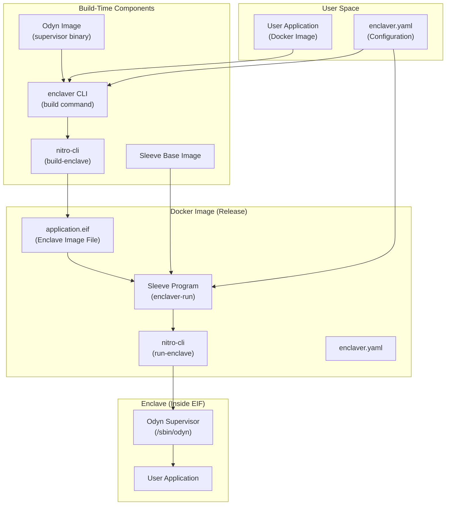
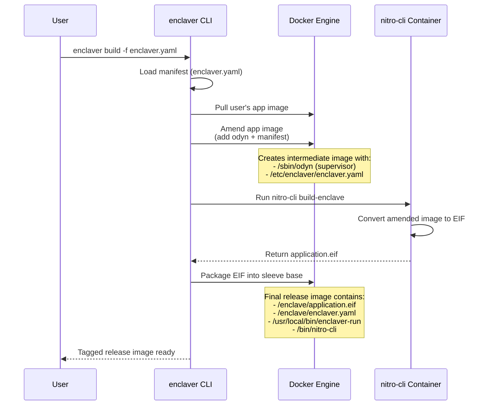
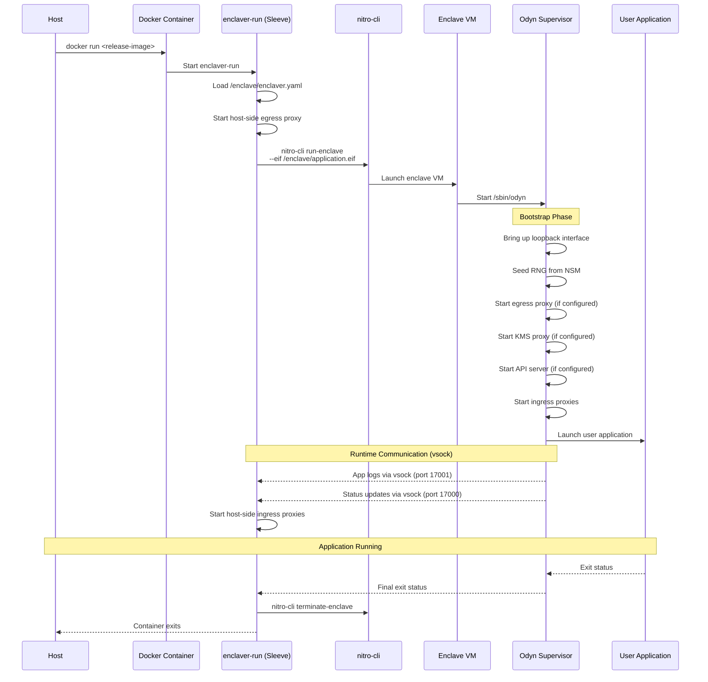
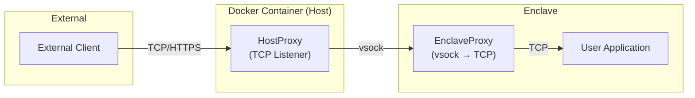
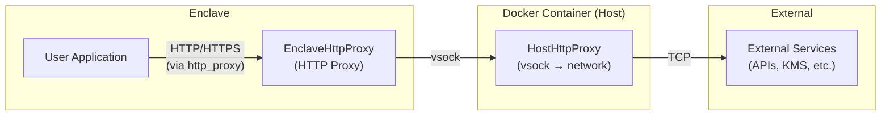
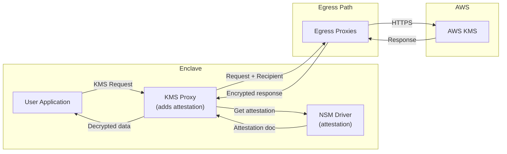
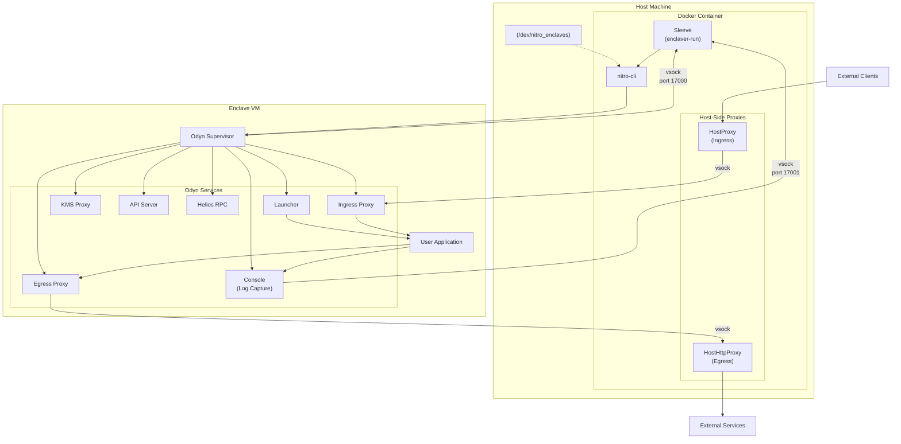

# Enclaver Runtime Architecture

This document provides a comprehensive overview of the Enclaver runtime architecture, explaining the relationships between all components and their responsibilities during both build-time and runtime phases.

---

## Table of Contents

1. [Component Overview](#component-overview)
2. [Build-Time Architecture](#build-time-architecture)
3. [Runtime Architecture](#runtime-architecture)
4. [What's Inside vs Outside the EIF](#whats-inside-vs-outside-the-eif)
5. [Module Relationships](#module-relationships)
6. [Data Flow Diagrams](#data-flow-diagrams)

---

## Component Overview

### High-Level Component Diagram



### Component Descriptions

| Component | Location | Description |
|-----------|----------|-------------|
| **User Application** | User's Docker image | Your backend service/application to be run inside the enclave |
| **enclaver.yaml** | User's project | Configuration file defining ingress, egress, API, and KMS proxy settings |
| **Odyn Supervisor** | Inside EIF | Enclave supervisor that manages the application lifecycle, networking, and services |
| **EIF (application.eif)** | Docker image | AWS Nitro Enclave Image File containing the enclave workload |
| **Sleeve (enclaver-run)** | Docker image | Host-side orchestrator that launches and manages the enclave |
| **nitro-cli** | Docker image / Build | AWS CLI tool for building and running Nitro Enclaves |
| **Docker Image** | Container registry | Final packaged image containing all runtime components |

---

## Build-Time Architecture

### Build Pipeline Flow



### Layer Structure of Release Image

```
┌─────────────────────────────────────────────────────────────┐
│                    Release Docker Image                     │
├─────────────────────────────────────────────────────────────┤
│  [Layer 3] /enclave/application.eif (EIF file)              │
├─────────────────────────────────────────────────────────────┤
│  [Layer 2] /enclave/enclaver.yaml (manifest)                │
├─────────────────────────────────────────────────────────────┤
│  [Layer 1] Sleeve Base Image                                │
│    ├── /usr/local/bin/enclaver-run (entry point)            │
│    ├── /bin/nitro-cli (AWS Nitro CLI)                       │
│    └── Runtime libraries and dependencies                   │
└─────────────────────────────────────────────────────────────┘
```

---

## Runtime Architecture

### Runtime Execution Flow



### Component Responsibilities at Runtime

#### Sleeve (enclaver-run) - Host Side
- **Location**: Runs inside the Docker container, outside the enclave
- **Responsibilities**:
  - Read configuration from `/enclave/enclaver.yaml`
  - Start host-side egress proxy (forwards enclave traffic to external networks)
  - Launch the enclave using `nitro-cli run-enclave`
  - Start host-side ingress proxies (listen on TCP ports, forward to enclave via vsock)
  - Monitor enclave status and logs via vsock connections
  - Handle enclave lifecycle (start, monitor, terminate)

#### Odyn Supervisor - Enclave Side
- **Location**: Runs inside the enclave (as PID 1)
- **Responsibilities**:
  - Bootstrap enclave platform (loopback interface, RNG seeding from NSM)
  - Parse and apply configuration from embedded `enclaver.yaml`
  - Start enclave-side ingress proxies (accept vsock connections, forward to app)
  - Start enclave-side egress proxy (intercept app's outbound traffic)
  - Start KMS proxy (handle AWS KMS requests with attestation)
  - Start internal API server (attestation, encryption, Ethereum endpoints)
  - Start Helios RPC service (trustless Ethereum/OP Stack light client)
  - Launch and supervise the user application
  - Capture app stdout/stderr and expose via vsock
  - Report application status to host via vsock

---

## What's Inside vs Outside the EIF

### Inside the EIF (Enclave)

```
┌────────────────────────────────────────────────────────┐
│               Enclave (application.eif)                │
├────────────────────────────────────────────────────────┤
│                                                        │
│  ┌──────────────────────────────────────────────────┐  │
│  │           Odyn Supervisor (/sbin/odyn)           │  │
│  │                                                  │  │
│  │  ┌────────────────────────────────────────────┐  │  │
│  │  │ Services:                                  │  │  │
│  │  │  • Ingress Proxy (vsock → app TCP)         │  │  │
│  │  │  • Egress Proxy (app HTTP → vsock)         │  │  │
│  │  │  • KMS Proxy (AWS KMS with attestation)    │  │  │
│  │  │  • API Server (attestation, encryption)    │  │  │
│  │  │  • Helios RPC (trustless Ethereum/OP Stack light client)  │  │  │
│  │  │  • Console (log capture & streaming)       │  │  │
│  │  │  • Launcher (app process management)       │  │  │
│  │  └────────────────────────────────────────────┘  │  │
│  └──────────────────────────────────────────────────┘  │
│                          │                             │
│                          ▼                             │
│  ┌──────────────────────────────────────────────────┐  │
│  │             User Application                     │  │
│  │       (from original Docker image)               │  │
│  └──────────────────────────────────────────────────┘  │
│                                                        │
│  Configuration: /etc/enclaver/enclaver.yaml            │
│                                                        │
└────────────────────────────────────────────────────────┘
```

**Components Inside EIF:**
- Odyn supervisor binary (`/sbin/odyn`)
- User application (original Docker image contents)
- Configuration file (`/etc/enclaver/enclaver.yaml`)
- All application dependencies and runtime

### Outside the EIF (Host/Container)

```
┌────────────────────────────────────────────────────────┐
│              Docker Container (Host Side)              │
├────────────────────────────────────────────────────────┤
│                                                        │
│  ┌──────────────────────────────────────────────────┐  │
│  │         Sleeve (enclaver-run)                    │  │
│  │                                                  │  │
│  │  ┌────────────────────────────────────────────┐  │  │
│  │  │ Host-Side Proxies:                         │  │  │
│  │  │  • Ingress HostProxy (TCP → vsock)         │  │  │
│  │  │  • Egress HostHttpProxy (vsock → network)  │  │  │
│  │  └────────────────────────────────────────────┘  │  │
│  │                                                  │  │
│  │  ┌────────────────────────────────────────────┐  │  │
│  │  │ Enclave Management:                        │  │  │
│  │  │  • Log streaming (vsock port 17001)        │  │  │
│  │  │  • Status monitoring (vsock port 17000)    │  │  │
│  │  │  • Debug console (optional)                │  │  │
│  │  └────────────────────────────────────────────┘  │  │
│  └──────────────────────────────────────────────────┘  │
│                                                        │
│  ┌──────────────────────────────────────────────────┐  │
│  │              nitro-cli                           │  │
│  │  • run-enclave (start enclave from EIF)          │  │
│  │  • describe-enclaves (query status)              │  │
│  │  • terminate-enclave (stop enclave)              │  │
│  └──────────────────────────────────────────────────┘  │
│                                                        │
│  Files:                                                │
│    /enclave/application.eif                            │
│    /enclave/enclaver.yaml                              │
│                                                        │
│  Device:                                               │
│    /dev/nitro_enclaves (mounted from host)             │
│                                                        │
└────────────────────────────────────────────────────────┘
```

**Components Outside EIF:**
- Sleeve program (`enclaver-run`)
- nitro-cli binary
- EIF file (`application.eif`)
- Configuration file (`enclaver.yaml`)
- Host-side proxy processes
- Device access (`/dev/nitro_enclaves`)

### Summary Table

| Component | Inside EIF | Outside EIF |
|-----------|:----------:|:-----------:|
| User Application | ✓ | |
| Odyn Supervisor | ✓ | |
| enclaver.yaml (copy) | ✓ | ✓ |
| Sleeve (enclaver-run) | | ✓ |
| nitro-cli | | ✓ |
| application.eif | | ✓ |
| Helios RPC Service | ✓ | |
| Host-side Proxies | | ✓ |
| Enclave-side Proxies | ✓ | |

---

## Module Relationships

### Ingress Traffic Flow



### Egress Traffic Flow



### KMS Attestation Flow



---

## Data Flow Diagrams

### Complete Runtime Architecture



### VSOCK Communication Ports

| Port | Direction | Purpose |
|------|-----------|---------|
| 17000 | Enclave → Host | Status updates (JSON stream) |
| 17001 | Enclave → Host | Application logs (stdout/stderr) |
| 17002 | Enclave → Host | HTTP egress proxy traffic |
| Dynamic | Host → Enclave | Ingress connections (per listener) |

---

## Summary

The Enclaver architecture provides a complete isolation solution:

1. **User Application**: Your backend service that needs to run in a trusted execution environment

2. **Odyn Supervisor**: The enclave-side component that:
   - Bootstraps the enclave environment
   - Provides networking proxies (ingress/egress)
   - Manages KMS attestation
   - Supervises the application lifecycle

3. **EIF File**: The encrypted enclave image containing:
   - Odyn supervisor
   - User application
   - Configuration

4. **Sleeve Program**: The host-side orchestrator that:
   - Launches the enclave via nitro-cli
   - Provides host-side proxies
   - Streams logs and status

5. **nitro-cli**: AWS tool for enclave lifecycle management

6. **Docker Image**: The complete package containing:
   - Sleeve program
   - nitro-cli
   - EIF file
   - Configuration

This architecture ensures that sensitive workloads run in an isolated, attested environment while maintaining connectivity with external services through carefully controlled proxy channels.
