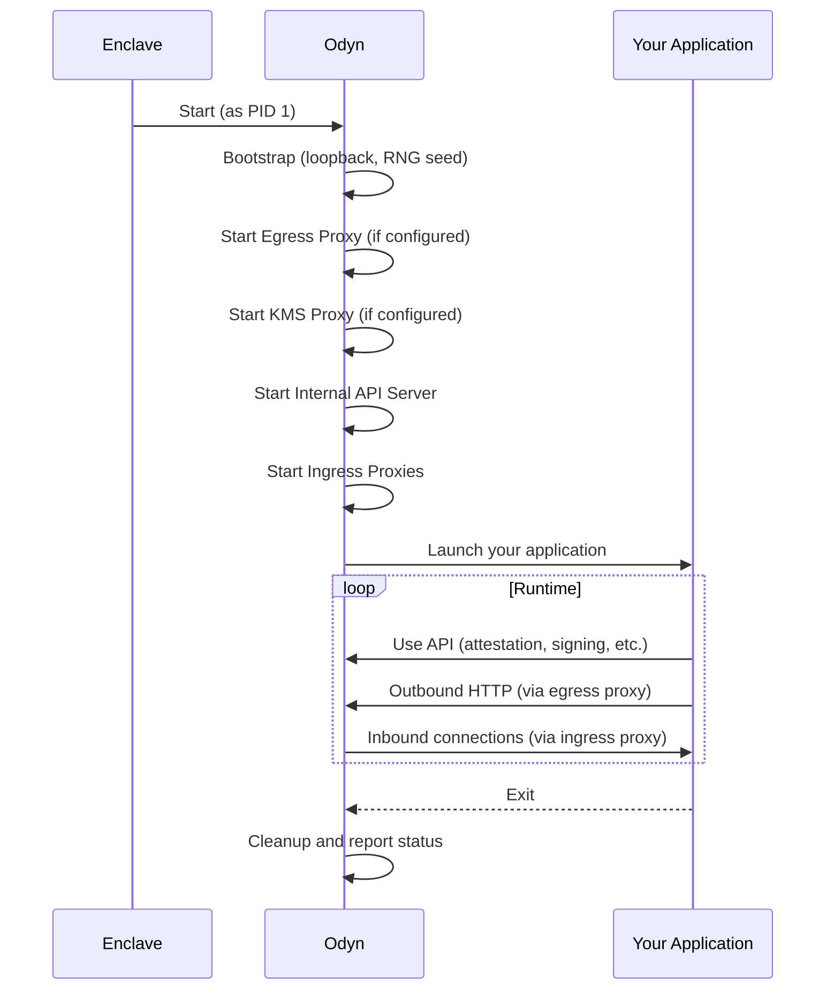

# Odyn — Enclave Supervisor

Odyn is the supervisor process that runs inside the AWS Nitro Enclave. It acts as the bridge between your application and the enclave's secure hardware features, providing essential services that make enclave development straightforward.

---

## What is Odyn?

**Odyn** (named after the Norse god Odin) is automatically injected into your application's Docker image during the `enclaver build` process. When your enclave starts, Odyn runs as PID 1 (the init process) and is responsible for:

1. **Bootstrapping the enclave environment** — Setting up networking and secure random number generation
2. **Launching your application** — Starting and supervising your application process
3. **Providing security services** — Attestation, signing, encryption via the Internal API
4. **Managing network connectivity** — Ingress proxies for incoming traffic, egress proxies for outgoing traffic
5. **Streaming logs and status** — Making application logs available to the host

```
┌─────────────────────────────────────────────────────────────┐
│                     AWS Nitro Enclave                       │
│                                                             │
│   ┌─────────────────────────────────────────────────────┐   │
│   │                 Odyn Supervisor                     │   │
│   │                    (PID 1)                          │   │
│   │                                                     │   │
│   │  ┌─────────┐ ┌─────────┐ ┌─────────┐ ┌──────────┐ ┌─────────┐  │   │
│   │  │ Ingress │ │ Egress  │ │   API   │ │   KMS    │ │ Storage │  │   │
│   │  │  Proxy  │ │  Proxy  │ │ Server  │ │  Proxy   │ │  (S3)   │  │   │
│   │  └─────────┘ └─────────┘ └─────────┘ └──────────┘ └─────────┘  │   │
│   │                      │                              │   │
│   │                      ▼                              │   │
│   │  ┌─────────────────────────────────────────────┐   │   │
│   │  │              Your Application               │   │   │
│   │  └─────────────────────────────────────────────┘   │   │
│   └─────────────────────────────────────────────────────┘   │
│                                                             │
└─────────────────────────────────────────────────────────────┘
```

---

## How Odyn Works with Your Application

### Startup Sequence

When the enclave starts, Odyn performs the following steps in order:



### Environment Variables Set by Odyn

Odyn automatically sets the following environment variables for your application:

| Environment Variable | Value | Condition |
|---------------------|-------|-----------|
| `http_proxy` | `http://127.0.0.1:<proxy_port>` | If egress is enabled |
| `https_proxy` | `http://127.0.0.1:<proxy_port>` | If egress is enabled |
| `HTTP_PROXY` | `http://127.0.0.1:<proxy_port>` | If egress is enabled |
| `HTTPS_PROXY` | `http://127.0.0.1:<proxy_port>` | If egress is enabled |
| `no_proxy` | `localhost,127.0.0.1` | If egress is enabled |
| `NO_PROXY` | `localhost,127.0.0.1` | If egress is enabled |
| `AWS_KMS_ENDPOINT` | `http://127.0.0.1:<kms_port>` | If kms_proxy is enabled |

> [!TIP]
> **Recommended Convention**: Use an `IN_ENCLAVE` environment variable in your Dockerfile to help your application detect whether it's running inside an enclave:
> ```dockerfile
> # Set to false in your base Dockerfile
> ENV IN_ENCLAVE=false
> ```
> Then in your application's layer (added during `enclaver build`), this can be overridden. Or, your application can detect the enclave environment by checking if the Odyn API is available at `http://127.0.0.1:<api_port>/v1/eth/address`.

---

## Odyn Modules

Odyn consists of several configurable modules, each providing specific functionality:

### 1. Ingress Proxy

**Purpose**: Allows external clients to connect to your application inside the enclave.

**How it works**:
- Listens on configured TCP ports inside the enclave
- Receives connections forwarded from the host via VSOCK
- Optionally terminates TLS
- Forwards traffic to your application's localhost port

**Configuration**:
```yaml
ingress:
  - listen_port: 8080        # Your app listens on 127.0.0.1:8080
    tls:                     # Optional TLS termination
      cert_file: cert.pem
      key_file: key.pem
```

**For your app**: Simply bind to `127.0.0.1:<listen_port>` — Odyn handles the rest.

---

### 2. Egress Proxy

**Purpose**: Allows your application to make outbound HTTP/HTTPS requests to approved destinations.

**How it works**:
- Runs a local HTTP proxy inside the enclave
- Sets `http_proxy` and `https_proxy` environment variables
- Enforces an allow/deny list for security
- Routes traffic through VSOCK to the host, which makes the actual network requests

**Configuration**:
```yaml
egress:
  proxy_port: 10000          # Default port for the proxy
  allow:
    - "api.example.com"      # Exact domain
    - "*.amazonaws.com"      # Wildcard subdomain
    - "169.254.169.254"      # IMDS (required for KMS)
  deny:
    - "*.internal.com"       # Block specific patterns
```

**For your app**: Most HTTP libraries automatically use `http_proxy`/`https_proxy` environment variables. No code changes needed.

---

### 3. Internal API Server

**Purpose**: Provides enclave-specific functionality to your application via HTTP endpoints.

**How it works**:
- Runs an HTTP server on a configured port
- Provides attestation, signing, encryption, and random number generation
- Uses the Nitro Secure Module (NSM) for hardware-backed security

**Configuration**:
```yaml
api:
  listen_port: 18000         # Internal API port
```

**Available Endpoints**:

| Endpoint | Method | Description |
|----------|--------|-------------|
| `/v1/eth/address` | GET | Get enclave's Ethereum address |
| `/v1/eth/sign` | POST | Sign message (EIP-191) |
| `/v1/eth/sign-tx` | POST | Sign Ethereum transaction |
| `/v1/random` | GET | Get 32 random bytes from NSM |
| `/v1/attestation` | POST | Generate attestation document |
| `/v1/encryption/public_key` | GET | Get P-384 encryption public key |
| `/v1/encryption/encrypt` | POST | Encrypt data for client |
| `/v1/encryption/decrypt` | POST | Decrypt data from client |
| `/v1/s3/get` | POST | Get object from S3 storage |
| `/v1/s3/put` | POST | Put object to S3 storage |
| `/v1/s3/list` | POST | List objects in S3 storage |
| `/v1/s3/delete` | POST | Delete object from S3 storage |

**For your app**: Make HTTP requests to `http://127.0.0.1:<api_port>/v1/...`

📖 **See [Internal API Reference](internal_api.md) for complete endpoint documentation.**

📖 **See [Internal API Mock Service](internal_api_mockup.md) for local development without an enclave.**

---

### 4. Auxiliary API

**Purpose**: Provides a restricted subset of the Internal API for sidecar processes or untrusted components.

**How it works**:
- Proxies requests to the Internal API
- Sanitizes attestation requests (removes `public_key` and `user_data` to prevent spoofing)
- Only exposes safe, read-only endpoints

**Configuration**:
```yaml
aux_api:
  listen_port: 18001         # Defaults to api_port + 1
```

**Available Endpoints**:

| Endpoint | Method | Restrictions |
|----------|--------|--------------|
| `/v1/eth/address` | GET | Same as Internal API |
| `/v1/attestation` | POST | `public_key` and `user_data` are removed |
| `/v1/encryption/public_key` | GET | Same as Internal API |

---

### 5. KMS Proxy

**Purpose**: Allows your application to use AWS KMS with automatic attestation.

**How it works**:
- Runs a KMS-compatible proxy inside the enclave
- Intercepts KMS SDK requests and adds attestation documents
- Retrieves AWS credentials from IMDS (via egress proxy)
- Signs requests and handles encrypted responses

**Configuration**:
```yaml
kms_proxy:
  listen_port: 9000
  endpoints:                  # Optional regional overrides
    us-east-1: kms.us-east-1.amazonaws.com
```

**Requirements**:
- Egress must allow `169.254.169.254` (IMDS)
- Egress must allow your KMS endpoint (e.g., `kms.us-east-1.amazonaws.com`)

**For your app**: Set `AWS_KMS_ENDPOINT` (automatically done by Odyn) and use the standard AWS SDK.

---

### 6. S3 Storage

**Purpose**: Provides automated persistent storage for enclave applications.

**How it works**:
- Proxies S3 requests to a dedicated S3 bucket
- Enforces key isolation (app-specific prefix)
- Uses IMDS-based credentials via the egress proxy
- Accessible via the Internal API

**Configuration**:
```yaml
storage:
  s3:
    enabled: true
    bucket: "my-app-data"
    prefix: "apps/my-service/"
    region: "us-east-1"
```

**For your app**: Use the Internal API `/v1/s3/...` endpoints.

**Requirements**:
- Egress must allow `169.254.169.254` (IMDS)
- Egress must allow your S3 endpoint (e.g., `s3.us-east-1.amazonaws.com` or `s3.amazonaws.com`)

---

### 7. Console & Log Streaming

**Purpose**: Captures your application's stdout/stderr and streams it to the host.

**How it works**:
- Redirects stdout/stderr to a ring buffer
- Exposes logs over VSOCK for the host to consume
- Reports application status (running, exited, error)

**VSOCK Ports** (used by Sleeve/host):

| Port | Purpose |
|------|---------|
| 17000 | Status stream (JSON) |
| 17001 | Application logs |

**For your app**: Just print to stdout/stderr as normal — Odyn captures everything automatically.

---

## Complete Configuration Example

Here's a complete `enclaver.yaml` showing all Odyn-related configuration:

```yaml
version: v1
name: "my-secure-app"
target: "my-secure-app:latest"

sources:
  app: "my-app:latest"

# Ingress: allow inbound connections on port 8080
ingress:
  - listen_port: 8080

# Egress: allow outbound HTTPS to specific domains
egress:
  proxy_port: 10000
  allow:
    - "api.openai.com"
    - "169.254.169.254"        # Required for KMS
    - "kms.us-east-1.amazonaws.com"

# Internal API for attestation and signing
api:
  listen_port: 18000

# Auxiliary API for sidecars (optional)
aux_api:
  listen_port: 18001

# KMS Proxy with attestation (optional)
kms_proxy:
  listen_port: 9000

# S3 Storage (optional)
storage:
  s3:
    enabled: true
    bucket: "my-app-data"
    prefix: "apps/my-service/"
```

---

## Summary

| Module | Port Config | Purpose | Your App Usage |
|--------|-------------|---------|----------------|
| **Ingress** | `ingress[].listen_port` | Accept external connections | Bind to `127.0.0.1:<port>` |
| **Egress** | `egress.proxy_port` | Make outbound HTTP requests | Automatic via `http_proxy` env var |
| **Internal API** | `api.listen_port` | Attestation, signing, encryption | HTTP to `http://127.0.0.1:<port>` |
| **Aux API** | `aux_api.listen_port` | Restricted API for sidecars | HTTP to `http://127.0.0.1:<port>` |
| **KMS Proxy** | `kms_proxy.listen_port` | AWS KMS with attestation | Use AWS SDK normally |
| **Storage** | N/A (Internal API) | Persistent S3 storage | HTTP to `/v1/s3/...` |
| **Helios RPC** | `helios_rpc.listen_port` | Trustless Ethereum RPC | HTTP to `http://127.0.0.1:8545` |
| **Console** | N/A (automatic) | Log streaming | Print to stdout/stderr |

---

## Related Documentation

- [Internal API Reference](internal_api.md) — Complete API endpoint documentation
- [Internal API Mock Service](internal_api_mockup.md) — Local development without an enclave
- [Helios RPC Integration](helios_rpc.md) — Trustless Ethereum light client
- [enclaver.yaml Reference](enclaver.yaml) — Complete manifest configuration
- [Architecture Overview](architecture.md) — System architecture and component relationships
- [Odyn Implementation Details](odyn_details.md) — Deep dive into code structure (for contributors)
