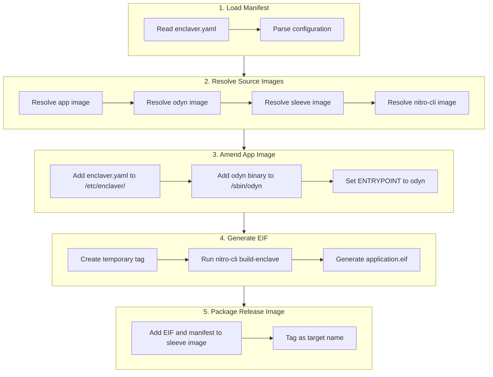
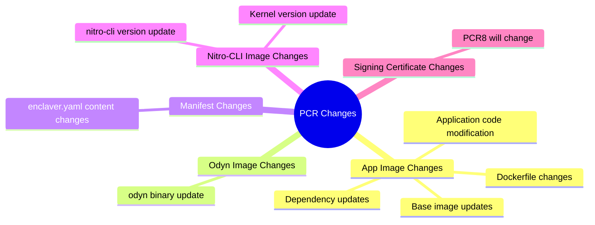

# Enclaver Build Process Explained & How to Keep PCRs Consistent

## Overview

This document explains in detail the execution flow of the `enclaver build -f enclaver.yaml` command and how to ensure the generated EIF file's PCR values remain consistent.

---

## 1. `enclaver build` Execution Flow

When you run `enclaver build -f enclaver.yaml`, the following steps are executed:



### Detailed Step Analysis

#### Step 1: Load Manifest
- **Entry function**: [build_release](file:///home/ubuntu/enclaver/enclaver/src/build.rs#L51-66)
- Calls [load_manifest()](file:///home/ubuntu/enclaver/enclaver/src/manifest.rs#126-131) to read and parse [enclaver.yaml](file:///home/ubuntu/enclaver/examples/hn-fetcher/enclaver.yaml)
- Validates configuration completeness

#### Step 2: Resolve Source Images
- **Function**: [resolve_sources](file:///home/ubuntu/enclaver/enclaver/src/build.rs#L371-408)
- Resolves the following 4 images:

| Image Type | Source | Default Value |
|------------|--------|---------------|
| **app** | `manifest.sources.app` | User specified (required) |
| **odyn** | `manifest.sources.odyn` | `public.ecr.aws/d4t4u8d2/sparsity-ai/odyn:latest` |
| **sleeve** | `manifest.sources.sleeve` | `public.ecr.aws/d4t4u8d2/sparsity-ai/sleeve:latest` |
| **nitro-cli** | Hardcoded internally | `public.ecr.aws/s2t1d4c6/enclaver-io/nitro-cli:latest` |

#### Step 3: Amend App Image
- **Function**: [amend_source_image](file:///home/ubuntu/enclaver/enclaver/src/build.rs#L129-215)
- Adds a new layer on top of the original app image containing:
  1. `/etc/enclaver/enclaver.yaml` - manifest configuration file
  2. `/sbin/odyn` - binary copied from the odyn image
- Sets new ENTRYPOINT:
  ```
  /sbin/odyn --config-dir /etc/enclaver [--work-dir <working_dir>] -- <original ENTRYPOINT> <original CMD>
  ```

#### Step 4: Generate EIF File
- **Function**: [image_to_eif](file:///home/ubuntu/enclaver/enclaver/src/build.rs#L254-327)
- Process:
  1. Tag the amended image with a temporary UUID tag
  2. Start the `nitro-cli` container
  3. Mount Docker socket and build directory
  4. Execute `nitro-cli build-enclave --docker-uri <tag> --output-file application.eif`
  5. If signing is configured, add `--signing-certificate` and `--private-key` parameters

> [!IMPORTANT]
> PCR0, PCR1, PCR2 (and optionally PCR8) are calculated during EIF generation

#### Step 5: Package Release Image
- **Function**: [package_eif](file:///home/ubuntu/enclaver/enclaver/src/build.rs#L217-252)
- Adds a new layer on top of the sleeve base image:
  - `/enclave/enclaver.yaml`
  - `/enclave/application.eif`
- Finally tags the image with the name specified in `manifest.target`

---

## 2. PCR Values Explained

AWS Nitro Enclaves use Platform Configuration Registers (PCRs) as the unique identity of an enclave:

| PCR | Measurement Content | Description |
|-----|---------------------|-------------|
| **PCR0** | SHA-384 hash of the entire EIF file | Represents the complete enclave image |
| **PCR1** | Hash of Linux kernel + boot ramdisk | Represents the enclave boot environment |
| **PCR2** | Hash of user application code (excluding boot ramfs) | Represents the actual running application |
| **PCR8** | Hash of signing certificate (if signing is used) | Proves the EIF origin |

---

## 3. Factors Affecting PCR Values

### 3.1 Factors That Will Change PCRs



### 3.2 Detailed Analysis

1. **App Image (`sources.app`)** - Affects PCR0, PCR2
   - Any code changes
   - Dependency version changes
   - Environment variable changes
   - File permission/timestamp changes

2. **Odyn Image (`sources.odyn`)** - Affects PCR0, PCR2
   - odyn binary file updates

3. **Manifest File** - Affects PCR0, PCR2
   - Any changes to [enclaver.yaml](file:///home/ubuntu/enclaver/examples/hn-fetcher/enclaver.yaml) (including whitespace and newlines)

4. **Nitro-CLI Image** - Affects PCR1
   - Internal Linux kernel version
   - Boot parameter changes

---

## 4. Methods to Keep PCRs Consistent

### Method 1: Pin All Image Versions (Recommended)

Explicitly specify the **digest** (not tag) for all images in [enclaver.yaml](file:///home/ubuntu/enclaver/examples/hn-fetcher/enclaver.yaml):

```yaml
version: v1
name: "my-app"
target: "my-app-enclave:latest"
sources:
  # Use digest instead of tag
  app: "my-app@sha256:abc123..."
  odyn: "public.ecr.aws/d4t4u8d2/sparsity-ai/odyn@sha256:def456..."
  sleeve: "public.ecr.aws/d4t4u8d2/sparsity-ai/sleeve@sha256:ghi789..."
```

> [!TIP]
> Use `docker inspect <image>` to get the image digest

### Method 2: Use Local Development Images

Build and pin images locally:

```yaml
sources:
  app: "my-app:v1.0.0-fixed"
  odyn: "odyn-dev:latest"
  sleeve: "sleeve:latest"
```

Then ensure these local images are not updated.

### Method 3: Pin Nitro-CLI Image Version

**Requires source code modification**. In [build.rs](file:///home/ubuntu/enclaver/enclaver/src/build.rs#L25):

```rust
// Current code
const NITRO_CLI_IMAGE: &str = "public.ecr.aws/s2t1d4c6/enclaver-io/nitro-cli:latest";

// Modify to fixed version
const NITRO_CLI_IMAGE: &str = "public.ecr.aws/s2t1d4c6/enclaver-io/nitro-cli@sha256:xxx...";
```

A better approach would be to support configuring the nitro-cli image in the manifest (requires feature extension).

### Method 4: Ensure Consistent Build Environment

| Factor | Recommendation |
|--------|----------------|
| Docker version | Pin the version |
| Build machine | Use the same CI environment |
| File system | Avoid timestamp effects |
| enclaver.yaml | Use version control, make no modifications |

### Method 5: Use EIF Signing + PCR8

If the main purpose is to verify EIF origin, you can use the signing feature:

```yaml
signature:
  certificate: ./signing.crt
  key: ./signing.key
```

This generates PCR8, which represents the hash of the signing certificate and can be used for KMS policy verification.

---

## 5. Verifying PCR Values

After the build completes, you can view the PCR values in the output:

```bash
$ enclaver build -f enclaver.yaml

# Example output:
{
  "Measurements": {
    "PCR0": "be7f3bfa8c460b9840f7440d4c834e42d209e1c780db9a3b63acef1a10c85cf2b6ce5d95cb34c796cf5e7f79f5fd8b5d",
    "PCR1": "4b4d5b3661b3efc12920900c80e126e4ce783c522de6c02a2a5bf7af3a2b9327b86776f188e4be1c1c404a129dbda493",
    "PCR2": "c810e8d6dbf7800b6099b13a4fa30f661c04ff2e66fddaa8b6a10df5f549b9d3275e43381aaec8dc5ff26c0148545415"
  }
}
```

You can also inspect an existing EIF file:

```bash
nitro-cli describe-eif --eif-path application.eif
```

---

## 6. Completeness Checklist

When trying to keep PCRs consistent, check the following items:

- [ ] Is the App image digest pinned?
- [ ] Is the Odyn image digest pinned?
- [ ] Is the Sleeve image digest pinned?
- [ ] Is the enclaver.yaml file content exactly the same (including whitespace and newlines)?
- [ ] Is the build environment consistent?
- [ ] Is the nitro-cli image version pinned (requires source code modification)?

---

## 7. Summary

```mermaid
flowchart LR
    A["Pin all image digests"] --> B["Keep manifest unchanged"]
    B --> C["Use consistent build environment"]
    C --> D["PCRs remain consistent ✓"]
```



The most reliable approach is:
1. Use image **digest** (sha256) instead of tags
2. Put [enclaver.yaml](file:///home/ubuntu/enclaver/examples/hn-fetcher/enclaver.yaml) under version control
3. Build in a fixed CI/CD environment
4. If needed, modify source code to pin the nitro-cli image version
