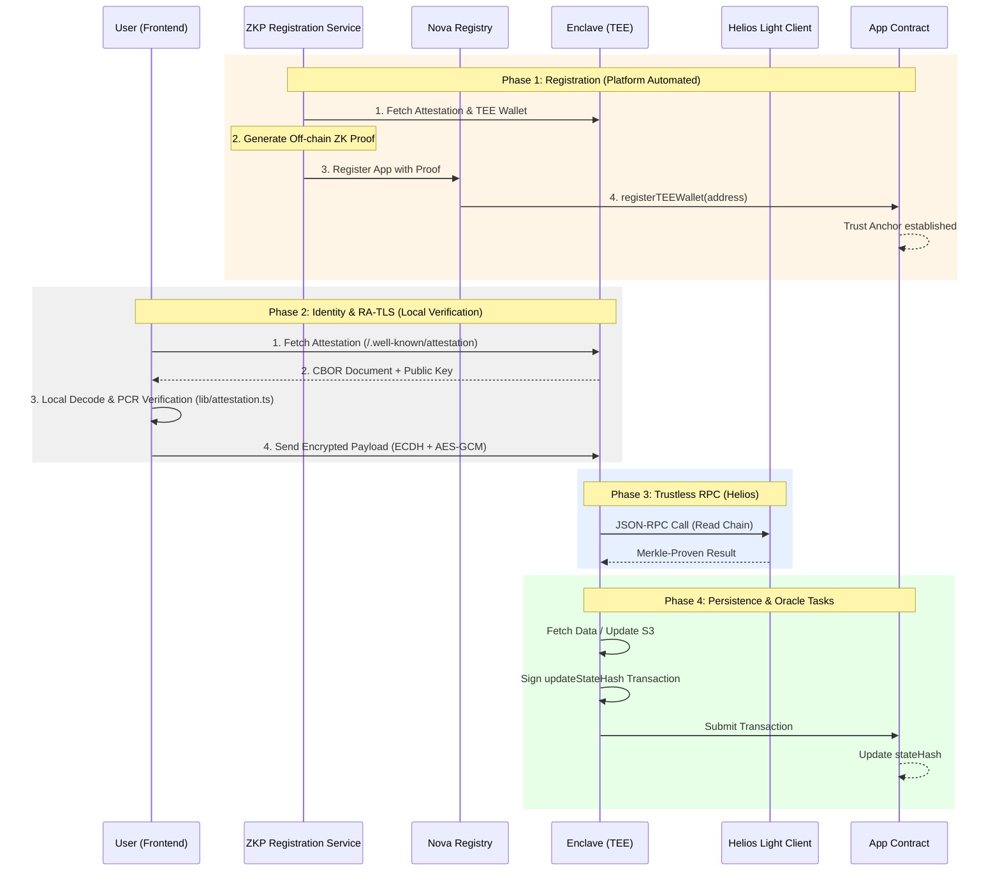

# Tutorial: Building & Deploying on Nova

This tutorial guides you through developing a production-ready, verifiable TEE application on the [Sparsity Nova Platform](https://sparsity.cloud). You will learn to use the Nova App Template to implement secure storage, internet-to-chain oracles, and RA-TLS encrypted communication.

---

## Table of Contents
1. [Architecture Overview](#1-architecture-overview)
2. [Development Environment Setup](#2-development-environment-setup)
3. [Smart Contract Deployment](#3-smart-contract-deployment)
4. [Enclave Configuration](#4-enclave-configuration)
5. [Local Testing (Mock Mode)](#5-local-testing-mock-mode)
6. [Building for Production](#6-building-for-production)
7. [Deploying to Nova Console](#7-deploying-to-nova-console)
8. [Verifying Your Application](#8-verifying-your-application)

---

## 1. Architecture Overview

### 1.1 Roles
The Nova ecosystem consists of several components working together to ensure verifiability:

| Role | Description |
|------|-------------|
| **Enclave (TEE)** | A secure container running in AWS Nitro Enclaves. It holds private keys and handles sensitive logic. |
| **Frontend (Browser)** | A React app that verifies the Enclave's identity and establishes an encrypted channel (RA-TLS). |
| **App Contract** | Serves as the immutable "Anchor" on-chain. It stores the TEE's state hashes and verified identity. |
| **S3 Storage** | Encrypted persistent storage provided by Nova, isolated to your specific app instance. |
| **Nova Registry** | A centralized registry that manages TEE identity registrations and verifies hardware measurements. |
| **Nova ZKP Registry** | Generates and stores Zero-Knowledge Proofs for TEE attestation, allowing for ultra-fast on-chain verification. |

### 1.2 Data Flow
The following diagram illustrates how your application interacts with the user, the platform, and the blockchain. Note the distinction between the one-time **Registration Phase** and the per-request **RA-TLS Phase**.



---

## 2. Development Environment Setup

Ensure you have **Python 3.10+**, **Node.js 18+**, and **Foundry** (for contracts) installed.

```bash
# 1. Clone the template
git clone https://github.com/sparsity-xyz/nova-app-template.git
cd nova-app-template

# 2. Install dependencies (Root)
# None required at root - managed via Makefile

# 3. Build the frontend (Compiles Next.js into the enclave/ folder)
make build-frontend
```

---

## 3. Smart Contract Deployment

Your app needs an "Anchor" on-chain. This template uses `ETHPriceOracleApp` which supports state anchoring and oracle prices.

```bash
cd contracts
forge install foundry-rs/forge-std
forge build

# Deploy to Base Sepolia
export RPC_URL=https://sepolia.base.org
export PRIVATE_KEY=<your_wallet_private_key>
forge script script/Deploy.s.sol:DeployScript --rpc-url "$RPC_URL" --private-key "$PRIVATE_KEY" --broadcast

# 1. Verify the contract on Etherscan/Basescan
export APP_CONTRACT=<deployed_contract_address>
export ETHERSCAN_API_KEY=<your_api_key>
forge verify-contract --chain-id 84532 --watch --etherscan-api-key "$ETHERSCAN_API_KEY" "$APP_CONTRACT" src/ETHPriceOracleApp.sol:ETHPriceOracleApp

# 2. Set the Nova Registry address on your contract
export NOVA_REGISTRY=0x...
cast send "$APP_CONTRACT" "setNovaRegistry(address)" "$NOVA_REGISTRY" --rpc-url "$RPC_URL" --private-key "$PRIVATE_KEY"
```

---

## 4. Enclave Configuration

Edit `enclave/config.py` to wire your contract into the backend. This file is static and does **not** read environment variables.

```python
# enclave/config.py

# 1. Update the contract address you just deployed
CONTRACT_ADDRESS = "0xYourDeployedContractAddress"

# 2. Enable broadcasting if you want the TEE to send txs automatically
BROADCAST_TX = True
```

---

## 5. Local Testing (Mock Mode)

Before deploying a real TEE, verify your logic locally.

### 5.1 Environment Setup
Create a virtual environment and install dependencies:

```bash
# 1. Create and activate venv
python3 -m venv venv
source venv/bin/activate

# 2. Install dependencies
pip install -r enclave/requirements.txt
```

### 5.2 Launching the App

```bash
# Terminal 1: Start Backend (Mock Mode)
make dev-backend

# Terminal 2: Start Frontend
make dev-frontend
```

### 5.3 Mock Registration (Required for Mock Testing)
In Mock Mode, your TEE wallet is generated locally. Since you aren't running on the production Nova Platform yet, you must manually register this mock address in your contract to bypass the `onlyTEE` checks:

1.  **Get your Mock TEE Address**: Look at the terminal where `make dev-backend` is running. You will see:
    `[Odyn] TEE Identity: 0x...`
2.  **Register it manually**:
    ```bash
    # 1. Set yourself as the 'Temporary Registry' (if not already set)
    export YOUR_ADDRESS=<your_deployer_address>
    cast send "$APP_CONTRACT" "setNovaRegistry(address)" "$YOUR_ADDRESS" --rpc-url "$RPC_URL" --private-key "$PRIVATE_KEY"

    # 2. Manually register the Mock TEE Identity
    export MOCK_TEE_ID=<the_address_from_logs>
    cast send "$APP_CONTRACT" "registerTEEWallet(address)" "$MOCK_TEE_ID" --rpc-url "$RPC_URL" --private-key "$PRIVATE_KEY"
    ```
    *Note: In production on the Sparsity Cloud, these steps are handled automatically by the Nova ZKP Registry.*

### 5.4 Test Frontend
1.  Open [http://localhost:3000/frontend](http://localhost:3000/frontend).
2.  Click **Connect** to establish an RA-TLS session with your local mock backend.
3.  Try the **S3 Storage** or **Oracle Update** features.

---

## 6. Building for Docker

When ready, prepare the final TEE container.

```bash
# 1. Build Docker Image
make build-docker

# 2. run docker contrainer
docker run -p 8000:8000 -e IN_ENCLAVE=false nova-app-template:latest
```

---

## 7. Deploying to Nova Console

1. **GitHub**: Push your code (including the updated `config.py`) to your repository.
2. **Nova Console**: Go to [nova.sparsity.cloud](https://nova.sparsity.cloud).
3. **App Creation**:
    - **Repository**: Select your repo.
    - **App Listening Port**: `8000`.
    - **Contract Address**: Enter your `APP_CONTRACT` address.
    - **Trustless RPC (Helios)**: Enabled (Ensures verifiable blockchain state).
    - **S3 Storage**: Enabled (The platform will automatically provision the bucket).
4. **Deploy**: Click "Deploy". Nova will build your EIF, launch the Nitro Enclave, and handle the ZKP registration.

---

## 8. Verifying Your Application

Once the status is **Running**:

1. **RA-TLS Handshake**: Use the "Encrypted Echo" feature in the UI. If it receives a reply, the RA-TLS handshake succeeded.
2. **Identity**: Copy the TEE address from the UI and verify it matches the `teeWallet` stored in your smart contract.
3. **State Anchoring**: Change a value in S3 storage and check if your contract's `stateHash` updates on Etherscan.
4. **Trustless RPC**: Check the `enclave` logs in Nova Console to see Helios syncing blocks from Base Sepolia.

---

## Troubleshooting

| Issue | Cause | Fix |
|-------|-------|-----|
| **Registry Error** | `setNovaRegistry` skipped | Ensure you called `setNovaRegistry` on your contract BEFORE deploying to Nova. |
| **Helios Sync Stuck** | No execution RPC | Ensure "Trustless RPC" is enabled in Nova Console during deployment. |
| **S3 Access Denied** | Not in TEE | S3 storage only works in a real enclave environment or when configured via Nova. |
| **404 on UI** | Missing bundle | Ensure `make build-frontend` was run before `make build-docker`. |

---

## Summary
Congratulations! You've deployed a verifiable application that combines **Nitro hardware security**, **Trustless Helios RPC**, and **On-chain State Anchoring**. 🚀
